<h1 align="center">
  <span>
    <a href="https://git.io/typing-svg"></a>
  </span>
</h1>


## ├──📂 Connect with me:

<p> 
<a href="mailto:sa109@wellesley.edu">  </a> 
<a href="www.linkedin.com/in/sheker-atayeva" target="_blank">  </a> 
</p>

<!-- ```sh
    > email      -> sa109@wellesley.edu
    > linkedin   -> linkedin.com/in/sheker-atayeva
``` -->


## ├──📂About me

```sh
name: Sheker
level: junior
location: Boston
academic interests:
    - Cognitive + Computer Sciences, especially to support vulnerable populations
    - Computational neuroscience & neuroimaging
hobbies:
    - Photography (check out my website), climbing (just started lead climbing) and reading (my fav book is "Howl's Moving Castle" by Diane Wynne Jones)
```

<!-- ## ├──📂Activity 
 -->

## └──Projects

```sh

```


<!-- <table align="center">
  <tr>
    <td align="center" width="33%">
      
    </td>
    <td align="center" width="34%">
      <p><strong>Access my portfolio!</strong></p>
      <p>
        <a href="https://www.caiocesardev.com.br" target="_blank">
          https://www.caiocesardev.com.br
        </a>
      </p>
    </td>
    <td align="center" width="33%">
      
    </td>
  </tr>
</table> -->


<!-- To use the ghstats.yml:  -->
<!-- 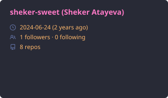
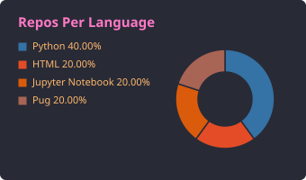
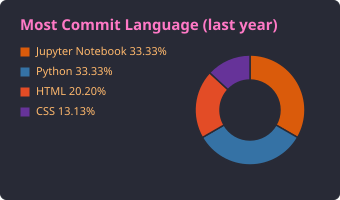
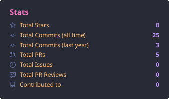
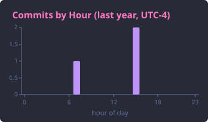
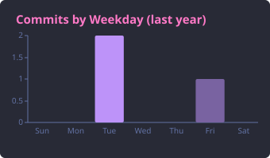
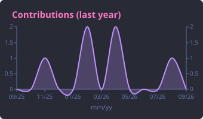
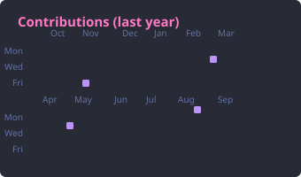
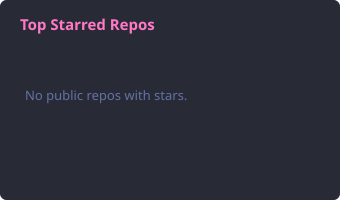
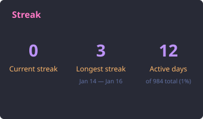
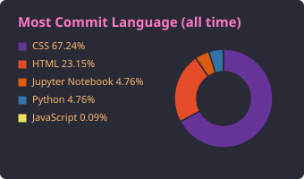
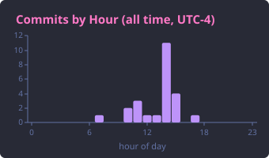
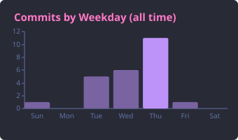
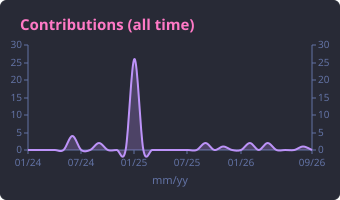
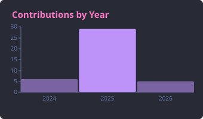
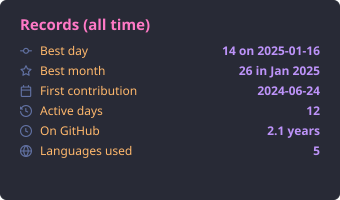 -->